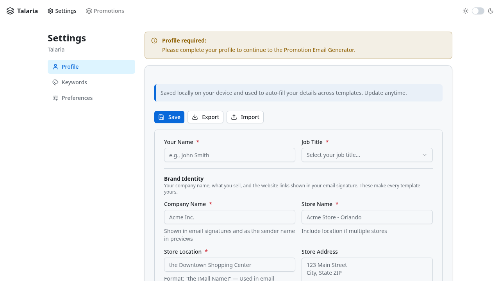

# Talaria — Documentation

Talaria is a campaign email & communication template generator for retail brands. It ships as a React web app and an optional Tauri desktop build.

## Contents

- **Screenshots** — Live app captures
- **ARCHITECTURE-MAP.md** — Module-level architecture reference
- **CHANGELOG.md** — Version history
- **SIGNATURE-FORMAT.md** — Email signature structure
- **UI-DECISIONS.md** — Deferred UI decisions log

## Screenshots

### Promotion Email Builder

The main builder with collapsible editor cards, live preview, and bulk BCC export.

### Profile & Settings

Brand-agnostic profile configuration — company, store, employees, keywords, and preferences.

## Quick Links

- [GitHub Repository](https://github.com/xcheljd/talaria)
- [README](../README.md)
- [ARCHITECTURE-MAP.md](ARCHITECTURE-MAP.md)
- [CHANGELOG.md](CHANGELOG.md)
